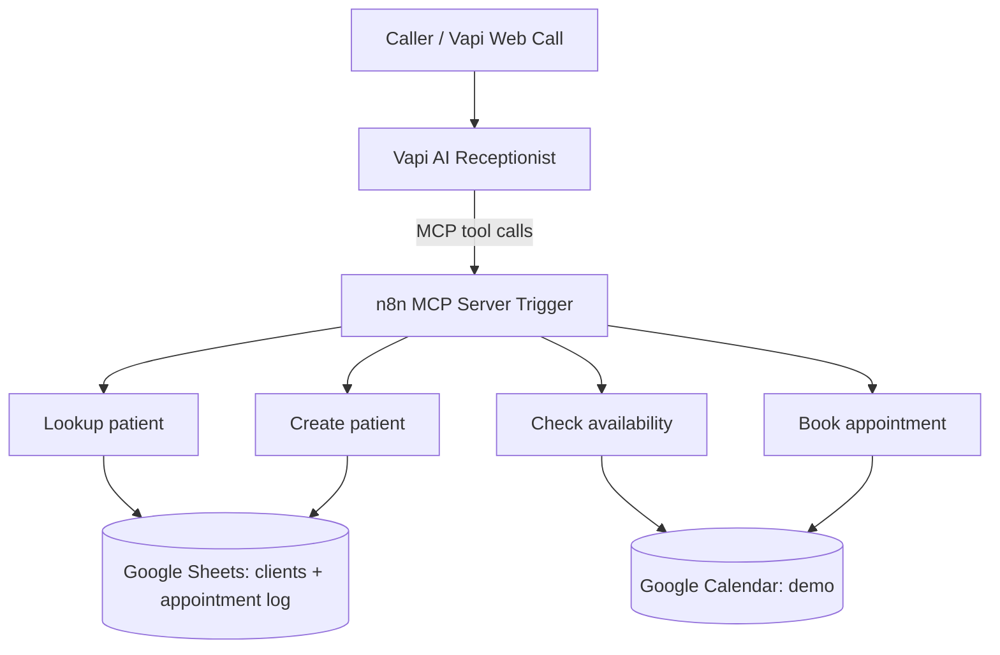

# System architecture

```mermaid
flowchart TB
  caller[Caller / Vapi Web Call] --> vapi[Vapi AI Receptionist]
  vapi -->|MCP tool calls| mcp[n8n MCP Server Trigger]
  mcp --> lookup[Lookup patient]
  mcp --> register[Create patient]
  mcp --> availability[Check availability]
  mcp --> booking[Book appointment]
  lookup --> sheets[(Google Sheets: clients + appointment log)]
  register --> sheets
  availability --> calendar[(Google Calendar: demo)]
  booking --> calendar
```

**Trust boundary:** Vapi-to-MCP authentication, data minimization, and calendar concurrency controls are production hardening tasks.
